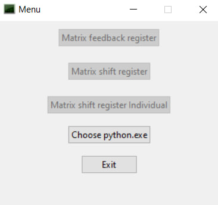
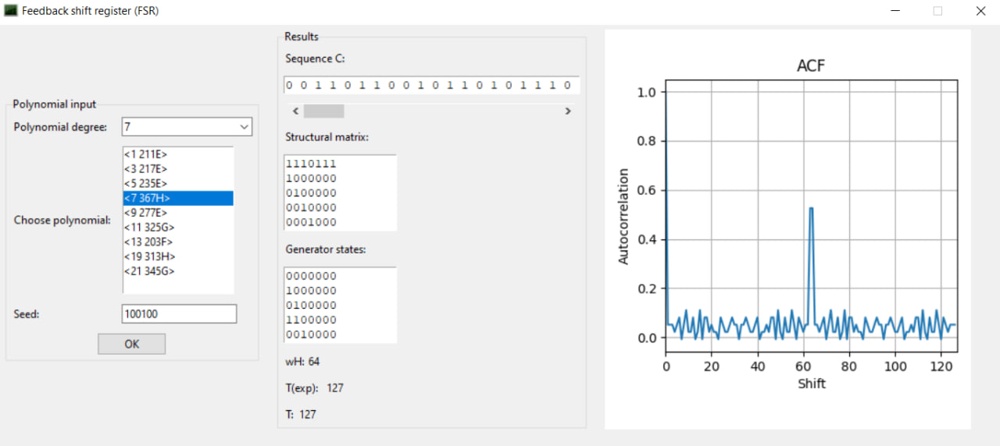
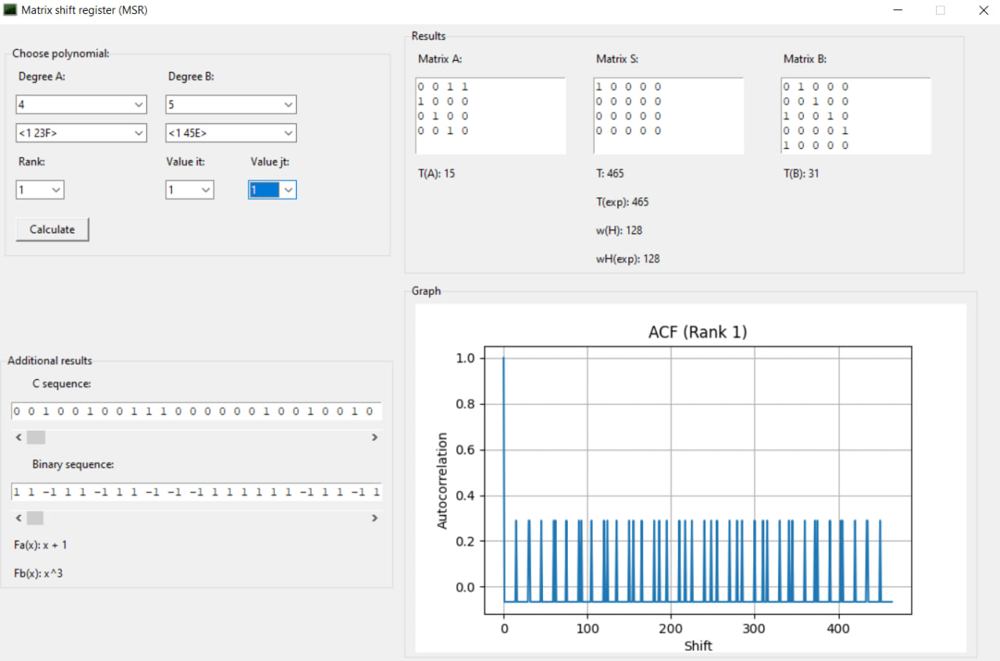
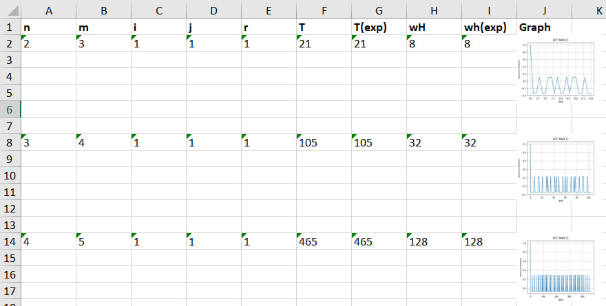

# Matrix Shift Register (MSR) and Feedback Shift Register (FSR) Application 📈

## Screenshots 📷

1. Menu


2. Feedback Shift Register (FSR)


3. Matrix Shift Register (MSR) 


4. Excel Output



## Installation 🔧

1. Clone the repository to your local machine:
    ```
    git clone https://github.com/your-username/your-repository.git
    ```

2. Navigate to the project directory:
    ```
    cd your-repository
    ```

3. Install the required dependencies:
    ```
    pip install -r requirements.txt
    ```

## Usage 💡

1. Ensure you have Python installed on your system.

2. Run the application by executing the `main.py` file:
    ```
    python main.py
    ```

3. Once the application window opens, you can interact with it to choose polynomials and perform calculations.


## File Structure 📂

- `main.py`: Main Python script containing the application code.
- `MSR`: Matrix Shift Register window script
- `FSR`: Feedback Shift Register window script
- `polynomial_utilities.py`: Utility functions for handling polynomials.
- `binary_utilities.py`: Utility functions for handling binary sequences.
- `polynomials.py`: List of polynomials.
- `calculator.py`: Class definition for the calculator used in register calculations.

## Contributing ✏️

If you would like to contribute to this project, please follow these steps:

1. Fork the repository on GitHub.
2. Create a new branch for your feature or bug fix.
3. Make your changes and commit them to your branch.
4. Push your changes to your fork.
5. Create a pull request against the main repository's `main` branch.

## License 🌓

This project is licensed under the MIT License.
